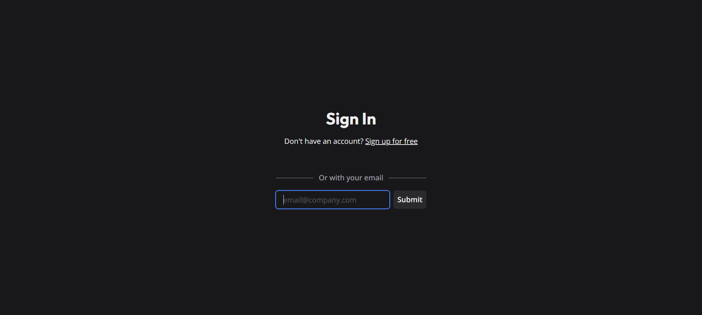
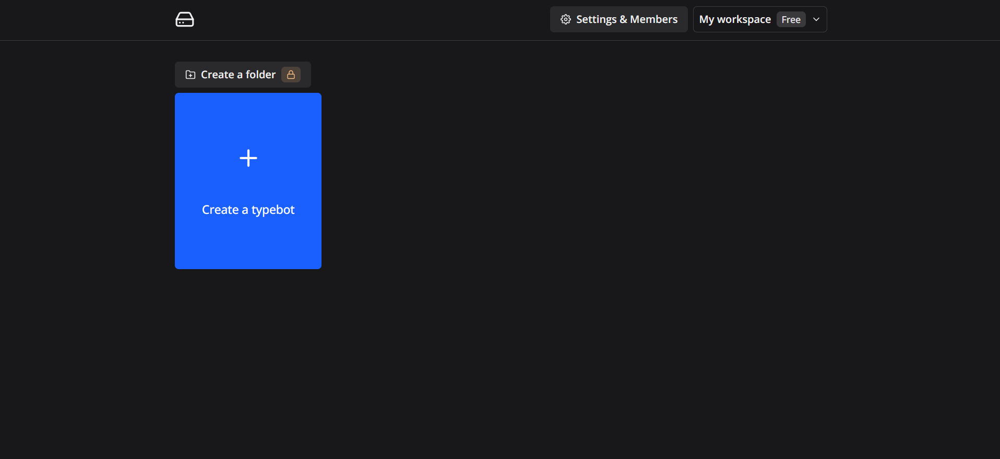
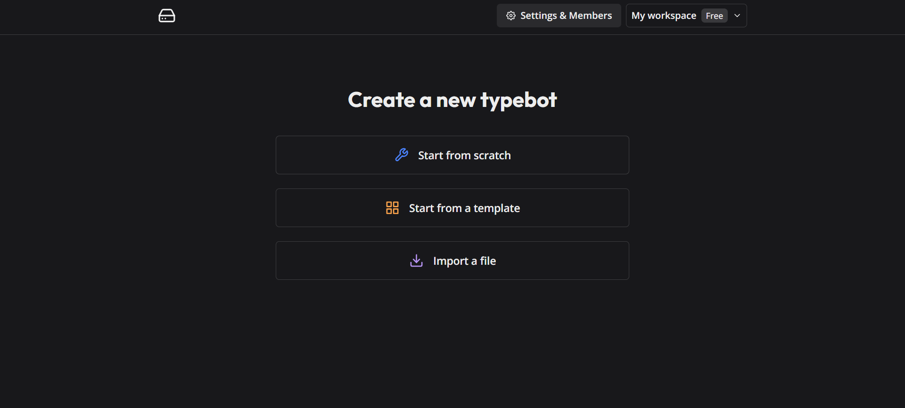
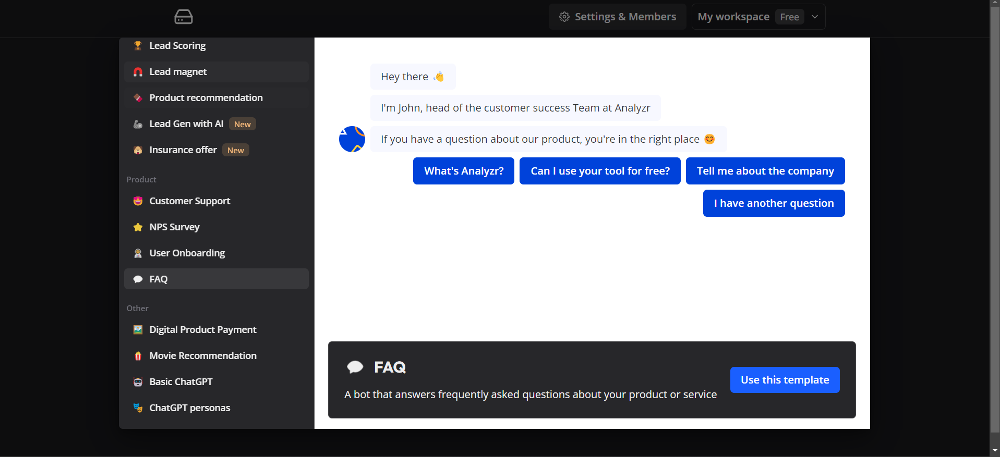
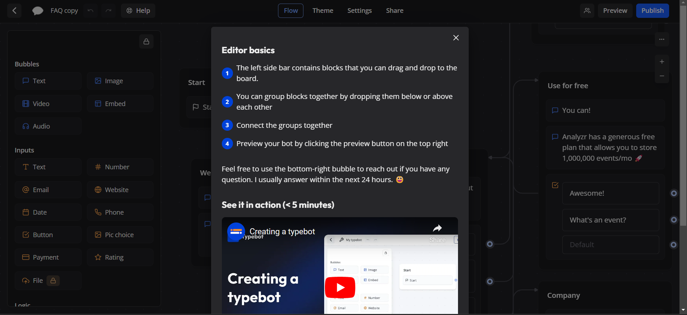
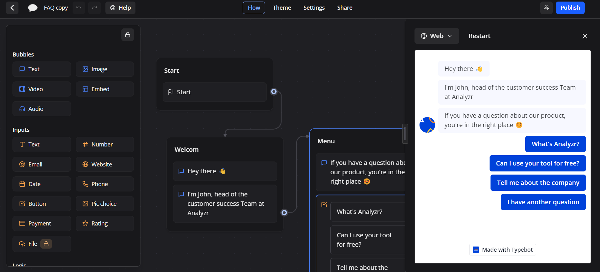
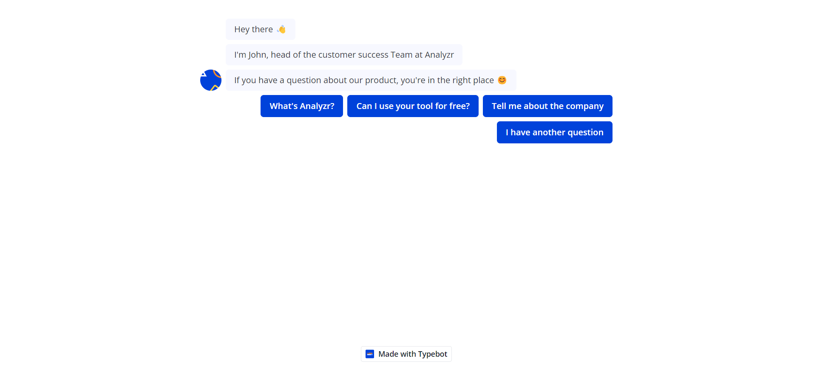

# Typebot - Railway Template

This example template to deploy a self-hosted version of [Typebot](https://typebot.io). 

## What is Typebot?
Typebot is an open-source alternative to Landbot. It allows you to create conversational apps/forms (Lead qualification, Product launch, User onboarding, Customer support), embed them anywhere on your web/mobile apps, and collect results in real-time.

The best way to understand the basic principles of Typebot is by watching the "Get started" video series:
 

## Features

Typebot makes it easy to create advanced chatbots. It provides the building block that are adaptable to any business use case. I improve Typebot regularly with bug fixes, new features, and performance improvements regularly.

**Chat builder** with 34+ building blocks such as:

- 💬 Bubbles: Text, Image / GIF, video, audio, embed.
- 🔤 Inputs: Text, email, phone number, buttons, picture choice, date picker, payment (Stripe), file picker... inputs
- 🧠 Logic: Conditional branching, URL redirections, scripting (Javascript), A/B testing
- 🔌 Integrations: Webhook / HTTP requests, OpenAI, Google Sheets, Google Analytics, Meta Pixel, Zapier, Make.com, Chatwoot, More to come...

**Theme** your chatbot to match your brand identity:

- 🎨 Customize the fonts, background, colors, roundness, shadows, and more
- 💪 Advanced theming with custom CSS.
- 💾 Reusable theme templates

**Share** your typebot anywhere:

- 🔗 Custom domain
- 👨‍💻 Embed as a container, popup, or chat bubble easily with the native JS library.
- ⚡ Blazing fast embed lib. No iframe, no external dependencies, no performance impact.
- 💻 Executable with HTTP requests

Collect your **Results** and get insights:

- 📊 In-depth analytics with drop-off rates, completion rates, and more
- 📥 Export results to CSV

Built for **developers**:

- 🔓 No vendor-locking. Features built with flexibility in mind.
- 💻 Easy-to-use [APIs](https://docs.typebot.io/api).

## ✨ Services

- Typebot (Builder & Viewer)
- PostgreSQL

## 💁‍♀️ How to use

- Click the Railway button 👆
- Add the required environment variables and **make sure to add atleast one auth provider (Email, Google, Github, Gitlab, Facebook, Azure AD or Custom) or else application will not work.** https://docs.typebot.io/self-hosting/configuration/builder
- Deploy
- Open the production URL of Builder
- Once you have configured the auth provider, you will be able to login and start building your bot.

- To create a new bot, click on the "+" On the center of the screen.

- You can either start from scratch or use one of the templates or import a bot.

- Typebot has a lot of templates that you can use to get started quickly.

- Once you have created a bot, you can start editing it.

- Here you can add questions, answers, actions, etc. Through which you can design the control flow of your bot.
- If you want to preview your bot and test it. Click on the "Preview" button on the top right corner.

- When you are done with your bot, you can publish it by clicking on the "Publish" button on the top right corner.

- Once you have published your bot, you can embed it on your website by clicking on the "Embed" option.
- Now your bot is ready to be used by your users.
- Enjoy 🎉

## 📝 Notes

- Source repo: https://github.com/baptisteArno/typebot.io
- Docs: https://docs.typebot.io/